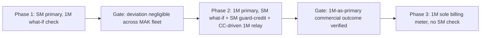
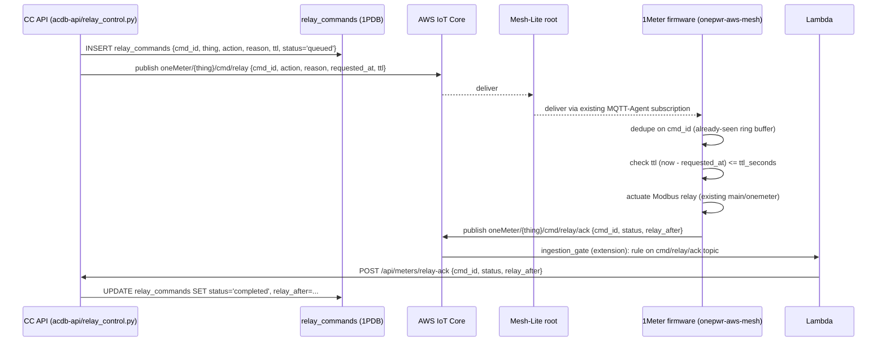

# 1Meter billing migration — testing protocol

**Status (2026-04-28):** Phase 1 in progress on the MAK fleet (8 customer
check meters at v1.1.1+, OTA-capable, publishing `FirmwareVersion` in
MQTT). Fleet-wide billing default is `sm`. No per-account overrides yet.
**Phase 2 enablement (infra-only) shipped 2026-04-28:** firmware
v1.1.2 OTA pushed to thing group `MAK_V1_1_1` (relay-cmd subscriber +
ack publisher), Lambda routes acks back to CC, guard-credit daemon
installed and gated off, `RELAY_AUTO_TRIGGER_ENABLED` stays 0. See
§"Phase 2 enablement" below.

## 1. Goal and rationale

We want to migrate primary energy billing from the SparkMeter (SM)
prepayment meter to the 1PWR 1Meter (1M) prototype, in three phases, on a
per-account basis, with full audit. Until we are confident in 1M numbers we
keep SM as the regulated billing instrument and run 1M alongside as a
"what-if" check. Once the variance between SM and 1M is small enough that
ops are willing to commit, we flip primacy: 1M becomes the billing meter,
SM is held in a positive-credit state so it never trips its own relay, and
CC drives cutoff via a new MQTT command channel directly to the 1Meter. In
Phase 3 the SM check meter is retired and 1M stands alone.

The driver is cost: a 1M is materially cheaper than a SparkMeter, and we
own the firmware and cloud, so longer-term we want to ship 1Meter-only
sites. This protocol is how we get from "SM only" to "1M only" without
breaking customer trust or commercial integrity.

## 2. Three-phase summary



| Phase | Billing source (charges customer) | Relay control | Parallel "what-if" computed | Status |
|-------|-----------------------------------|---------------|-----------------------------|--------|
| 1 (now) | **SM** (`thundercloud` / `koios`) | SM (existing prepayment) | 1M balance | Active on MAK |
| 2 | **1M** (`iot`) | CC -> AWS IoT -> 1M relay; SM kept positive via guard-credit so SM never trips | SM balance | Designed, gated off |
| 3 | **1M** only | 1M | None; SM check meters retired or repurposed | Not started |

## 3. Configuration knobs

All three knobs are read by [`acdb-api/balance_engine.py`](../../acdb-api/balance_engine.py)
`_resolve_billing_priority()` in this precedence:

1. **`accounts.billing_meter_priority`** — per-account override
   (`'sm'`, `'1m'`, or `NULL`). Set via
   `PATCH /api/billing-priority/{account_number}`. Audited in
   `cc_mutations`. Use this for selective per-account rollouts during
   each phase.
2. **`system_config(key='billing_meter_priority')`** — fleet-wide default.
   Set via `PATCH /api/billing-priority` (superadmin-only). Audited.
   Phase 1 -> 2 transition flips this from `'sm'` to `'1m'`.
3. **Hardcoded fallback** — `'sm'`. Used only if both lookups fail.

Other knobs:

* **`RELAY_AUTO_TRIGGER_ENABLED`** (env on the CC backend host) — `1` to
  arm balance-zero auto-cutoff in [`acdb-api/relay_control.py`](../../acdb-api/relay_control.py)
  `maybe_auto_open_relay()`. Default `0` (no-op). Flip to `1` at Phase 2
  entry, after the guard-credit daemon and firmware subscriber are live.
* **`IOT_INGEST_KEY`** (env, shared between CC and ingestion_gate Lambda) —
  also gates the inbound `POST /api/meters/relay-ack` endpoint.

## 4. Phase 1 — SM primary, 1M what-if (current)

### Billing rule

For each `(account, reading_hour)` the balance engine picks **one** source
based on the resolved priority. With Phase 1 default `'sm'`:

| Hour has | Picked |
|----------|--------|
| SM (TC/Koios) row | **SM** (1M is ignored) |
| Only 1M (`iot`) row | 1M (gap-fill) |
| Both | **SM** (1M is ignored) |

This replaces the previous `MAX(kwh)` dedup which silently let either
source override the other. The change is in
[`acdb-api/balance_engine.py`](../../acdb-api/balance_engine.py)
`_consumption_kwh()` — implemented via a `MAX(...) FILTER (WHERE source ...)`
common-table expression so SM and 1M are tracked separately per hour and the
priority chooses one with the other as fallback.

### What-if 1M balance

`get_balance_kwh_what_if(conn, account)` returns both the actual balance
and the balance the account would have under the opposite primacy:

```python
{
    "actual_priority": "sm",
    "actual_balance_kwh": 12.34,
    "what_if_priority": "1m",
    "what_if_balance_kwh": 12.20,
    "implied_balance_delta_kwh": -0.14,
}
```

It surfaces on the [Check Meters page](../../acdb-api/frontend/src/pages/CheckMeterPage.tsx)
per pair-card. Diagnostic only: never written to `transactions`.

### Read the Check Meters page during Phase 1

The page already shows total + mean + stddev deviation per pair. Phase 1
adds three lines per card (when `pair.balance_what_if` is present):

* `Balance (SM primary)` — actual current kWh balance.
* `What-if (1M primary)` — what the balance would be under 1M primacy.
* `Implied delta` — `what_if - actual` (positive = customer would have
  more credit under 1M; negative = less).

### MAK fleet roster (Phase 1 test population)

| Thing | Short ID | Account | OTA-capable | Notes |
|-------|----------|---------|-------------|-------|
| OneMeter5 | 23022646 | 0119MAK | yes (v1.1.1) | |
| OneMeter11 | 23022613 | repeater | yes | infra (not in `meters`) |
| OneMeter13 | 23022673 | 0045MAK | yes | original canary target |
| OneMeter14 | 23021847 | 0026MAK | yes | |
| OneMeter15 | (TBD) | (TBD) | TBD | |
| OneMeter16 | 23022696 | 0025MAK | yes | |
| OneMeter17 | 23022667 | gateway | yes | infra (not in `meters`) |
| OneMeter18 | 23022628 | 0005MAK | yes | |
| OneMeter12 | 23021888 | 0058MAK | TBD | |
| OneMeter19 | 23022684 | 0051MAK | TBD | |
| OneMeter122 | 23021886 | 0056MAK | TBD | |

Provenance and reflash status live in the
[1Meter OTA trust inventory](./1meter-ota-trust-inventory.md).

### Phase 1 -> Phase 2 entry criteria (to be confirmed by ops)

* **Per-pair total deviation `|total_deviation_pct|` <= X%** over the
  trailing Y days (placeholder X = 5, Y = 30). Read from the Check Meters
  page.
* **`n_matched_hours` >= Z** per pair (placeholder Z = 200) so the
  comparison is statistically meaningful, not a couple of points.
* **No outlier pair** with `total_deviation_pct` > 2X%. One bad meter
  blocks fleet-wide flip even if the average is fine.
* **Implied balance delta is small** in operational terms (e.g. each
  pair's `implied_balance_delta_kwh` is within +/- 1 day of typical
  consumption). Stronger than just deviation %; catches cases where
  small % deviation accumulates over months.
* **Ops sign-off** recorded in `cc_mutations` (the `PATCH /api/billing-priority`
  call to flip the fleet default is itself the recorded decision).

X / Y / Z values to be set by ops before exit; placeholders only here.

## 5. Phase 2 — 1M primary, SM guard-credit, CC-driven relay

Three things happen at the same moment:

1. Fleet default flips to `1m`. From the next billing-cycle hour, every
   account without a per-account override uses 1M for its balance.
2. The **SparkMeter guard-credit daemon** starts pushing compensating
   credits to SM via Koios/TC so SM-side balance never reaches the
   level that would trigger SM's own relay.
3. **`RELAY_AUTO_TRIGGER_ENABLED=1`**. When 1M-primary balance hits zero,
   CC publishes a relay-open command to the 1Meter directly via AWS IoT,
   bypassing SM.

### Relay command channel design



#### What is shipped today (commit `<this PR>`)

* **`acdb-api/relay_control.py`** — `POST /api/meters/{thing}/relay`
  (employee, role-gated to `superadmin` / `onm_team`), publishes via
  `boto3 iot-data` to topic `IOT_RELAY_TOPIC_FMT` (default
  `oneMeter/{thing}/cmd/relay`), records the row in `relay_commands`,
  paired `cc_mutations` audit row, debounce + payment-grace + online
  fail-safes (overridable with `force=true`).
* **`POST /api/meters/relay-ack`** — auth via `X-IoT-Key`, idempotent on
  `cmd_id`, moves row to `completed` / `rejected` / `failed`.
* **`maybe_auto_open_relay(conn, account)`** — gated by
  `RELAY_AUTO_TRIGGER_ENABLED`; called from
  [`balance_engine.record_payment_kwh()`](../../acdb-api/balance_engine.py)
  when balance ends <= 0. No-op until Phase 2 entry.
* **Migration `016_relay_commands.sql`** — audit table.

#### Phase 2 enablement: shipped 2026-04-28

The three follow-ups previously listed as "designed but NOT shipped"
have been built. Auto-cutoff (`RELAY_AUTO_TRIGGER_ENABLED`) and the
guard-credit daemon (`GUARD_CREDIT_ENABLED`) are still **gated off** in
env until ops confirm Phase 1 exit criteria. No real-account primacy
flips yet.

##### Firmware: relay command subscriber (shipped as v1.1.2)

In [`onepwr-aws-mesh`](../../../onepwr-aws-mesh) — commit
`58df6f8 feat(relay-cmd): add 1Meter relay command channel; bump to
1.1.2`:

* New task `main/tasks/onemeter_relay_cmd/{c,h}` (sibling of
  `onemeter_mqtt`) subscribes to
  `oneMeter/${CONFIG_GRI_THING_NAME}/cmd/relay` via the existing
  core-MQTT-Agent. The thing name is taken from
  `CONFIG_GRI_THING_NAME`, so each device only receives its own
  commands.
* On message:
  1. Validate JSON via coreJSON; extract `cmd_id`, `meter_id`,
     `action`, `requested_at_unix`, `ttl_seconds`.
  2. Dedup against a 16-entry RAM ring buffer of recent `cmd_id`s.
     RAM-only (not NVS) — TTL handles the rare reboot+redeliver case
     and the cost of one duplicate actuation in that path is
     acceptable.
  3. Reject if `time(NULL) - requested_at_unix > ttl_seconds` (ack
     `{status:"rejected", error:"ttl_expired"}`). If the on-device
     clock isn't synced (returns 0) the check rejects all commands —
     a safe failure mode.
  4. Call `meter_string_open_relay(meter_id)` /
     `meter_string_close_relay(meter_id)` (already public in
     `main/onemeter/meter_string.h`), which wraps the existing
     `onemeter_modbus_open_relay` / `close_relay` setters.
  5. Read back the current relay via the cached
     `DDS8888_Data_t.relayState` and publish ack on
     `oneMeter/${CONFIG_GRI_THING_NAME}/cmd/relay/ack` with
     `{cmd_id, meter_id, status:"acked", relay_after:"0"|"1"}`.
* Anti-rollback: `CONFIG_GRI_OTA_DEMO_APP_VERSION_BUILD=2`
  (= 1.1.2). Embed cert stays v2 (`03:9E:44:...`). Signing profile
  stays `1PWR_OTA_ESP32_v2`.
* OTA: created via `aws iot create-ota-update --ota-update-id
  1m-v1-1-2-relay-cmd-<ts>` targeting thing group `MAK_V1_1_1`
  (OneMeter11 / 13 / 17 / 18). Field team's remaining serial flashes
  use the v1.1.2 release artifacts directly.
* Trust note: no `DevicePolicy` change required — the existing policy
  grants `iot:Subscribe`/`Receive`/`Publish` broadly on
  `arn:aws:iot:us-east-1:758201218523:*`, which already covers
  `oneMeter/*` topics. The IAM addition required for Phase 2 is on
  the **CC host side** (publish from CC); see §IAM below.

The CC-side MQTT payload now includes `meter_id` (so the firmware can
route to the right Modbus device) and `requested_at_unix` (epoch
seconds, integer, so the firmware can do TTL math without ISO-8601
parsing on-device).

##### ingestion_gate Lambda: forward relay acks

In [`ingestion_gate`](../../../ingestion_gate) — `meter_ingest_gate.py`:

* `lambda_handler` dispatches on `event.mqttTopic`: topics ending in
  `/cmd/relay/ack` go through `_handle_relay_ack(event)`; everything
  else goes through the existing telemetry path unchanged.
* `_handle_relay_ack` POSTs `{thing_name, cmd_id, meter_id, status,
  relay_after, error}` to
  `os.environ.get("ONEPDB_RELAY_ACK_URL", "https://cc.1pwrafrica.com/api/meters/relay-ack")`
  with header `X-IoT-Key: ${ONEPDB_API_KEY}`. Failures log and return
  success so AWS doesn't retry the IoT rule (CC's endpoint is
  idempotent on `cmd_id`; firmware would re-ack on next state change
  cycle if necessary).
* IoT Rule `onemeter_relay_ack_rule` (created via
  `aws iot create-topic-rule` 2026-04-28):

  ```text
  SQL    : SELECT *, topic() AS mqttTopic, topic(2) AS thing_name,
                clientid() AS clientId
           FROM 'oneMeter/+/cmd/relay/ack'
  Action : lambda meter_ingestion_gate
  ```

  Lambda permission: `iot.amazonaws.com` granted
  `lambda:InvokeFunction` (statement id `iot-relay-ack-rule`).

##### SparkMeter guard-credit daemon

In [`onepowerLS/1PDB`](../../../1PDB) — `services/sparkmeter_guard_credit.py`,
run by `cc-guard-credit.timer` every 30 min on the CC host.

* For each account where `accounts.billing_meter_priority='1m'`:
  1. Sum `hourly_consumption.kwh` from SM sources
     (`thundercloud`/`koios`) since the timestamp of the last
     `cc_mutations` row with `action='phase2_guard_credit'` and
     `record_id=<account>` (or start-of-time on first cycle).
  2. If `consumed_kwh < GUARD_CREDIT_MIN_KWH` (default 1.0): skip.
  3. Resolve the tariff rate (via the same logic as
     `acdb-api/payments._get_tariff_rate`).
  4. Call
     `credit_sparkmeter(account, consumed_kwh * rate, memo, external_id="phase2_guard_credit:{account}:{utc_iso}")`.
     `external_id` makes Koios / ThunderCloud idempotent.
  5. **Crucially: do NOT call `record_payment_kwh()`.** That would
     also credit the customer's 1PDB-side (1m-primary) balance,
     which is wrong. The daemon only pushes credit to SM and logs
     the cycle; the customer's primary balance stays driven by 1M
     consumption.
  6. Append a `cc_mutations` row with `action='phase2_guard_credit'`,
     `record_id=<account>`, `event_metadata.kind='phase2_guard_credit'`,
     and the full `sm_credit_result`.
* Off by default. Off-switch: `GUARD_CREDIT_ENABLED=0` in
  `/etc/default/cc-guard-credit`. When unset/`0`, the script logs
  `daemon disabled, exiting cleanly` and returns; the timer continues
  to fire safely.
* Why no SM-balance read: `acdb-api/sparkmeter_credit.py` exposes
  only `credit_sparkmeter()` (write). Adding a balance read would
  require new TC/Koios endpoints. We sidestep by tracking consumption
  locally and pushing matching credit each cycle — anything we credit
  equals what we consumed, so SM-side balance grows monotonically.

#### Phase 2 fail-safes (already encoded in `relay_control.py`)

| Fail-safe | Window | Override | Rationale |
|-----------|--------|----------|-----------|
| Debounce | 10 min | `force=true` | Don't bounce a customer's relay on every tick of a flaky balance |
| Payment grace (open only) | 5 min | `force=true` | Avoid a race where a payment lands seconds after auto-cutoff |
| Online check | 30 min | `force=true` | Don't queue a command at a meter that's offline; let the sweeper retry once it reconnects |
| TTL | per-command (default 300 s) | n/a | Firmware drops a command that has been delayed by mesh reroute or queueing |
| Idempotency | per `cmd_id` | n/a | Both CC (DB UNIQUE on `cmd_id`) and firmware (NVS ring buffer) |

#### IAM additions for Phase 2

The CC host (`1pdb-api`, FastAPI under `cc_api` user) calls
`boto3.client("iot-data").publish(...)` from
[`acdb-api/relay_control.py`](../../acdb-api/relay_control.py)
`_iot_publish()`. The runtime identity is whatever boto3 picks up: an
EC2 instance role if attached, otherwise the
`AWS_ACCESS_KEY_ID`/`AWS_SECRET_ACCESS_KEY` in `/opt/1pdb/.env` (the
same identity `prototype_sync.py` already uses for DynamoDB).

That identity needs `iot:Publish` on the relay command topic ARN. The
existing IAM policy for the CC host does not (current usage is
DynamoDB read + S3 write only).

**Identify the runtime identity (run on the CC host as `cc_api`):**

```bash
aws sts get-caller-identity
# → either {Arn: ".../<role>/..."} for an instance role, or
#   {Arn: ".../<user>"} for an IAM user.
```

**Inline policy snippet to attach (least-privilege):**

```json
{
    "Version": "2012-10-17",
    "Statement": [{
        "Sid": "OneMeterRelayCmdPublish",
        "Effect": "Allow",
        "Action": "iot:Publish",
        "Resource": "arn:aws:iot:us-east-1:758201218523:topic/oneMeter/*/cmd/relay"
    }]
}
```

Save as `/tmp/cc-relay-publish.json` and attach with **one** of:

```bash
# Instance role path
aws iam put-role-policy \
  --role-name <role-name-from-sts> \
  --policy-name cc-relay-cmd-publish \
  --policy-document file:///tmp/cc-relay-publish.json

# IAM user path
aws iam put-user-policy \
  --user-name <user-name-from-sts> \
  --policy-name cc-relay-cmd-publish \
  --policy-document file:///tmp/cc-relay-publish.json
```

**Verify (from the CC host as `cc_api`):**

```bash
aws iot-data publish \
  --topic oneMeter/OneMeter13/cmd/relay \
  --qos 1 \
  --payload "$(echo -n '{}' | base64)" \
  --region us-east-1
# → no output on success; AccessDeniedException without the policy.
```

We did not auto-attach because granting new runtime permissions to the
CC host is an ops decision and we don't yet know whether the identity
is a role or user.

#### Phase 2 enablement: env-flag flip procedure

When ops are ready to actually start using the channel:

1. **Verify infra:** all four Phase 2 follow-ups are deployed (firmware
   v1.1.2 confirmed via `prototype_meter_state.firmware_version='1.1.2'`
   for the target thing-group; Lambda log shows
   `Forwarded relay-ack to 1PDB`; IAM publish policy attached; guard-credit
   service+timer installed but disabled).
2. **Pick test accounts** (start with one MAK customer who has volunteered
   or is internal). For each, set the per-account override:

   ```bash
   curl -X PATCH https://cc.1pwrafrica.com/api/billing-priority/<account_number> \
     -H 'Authorization: Bearer <employee-token>' \
     -H 'Content-Type: application/json' \
     -d '{"priority": "1m"}'
   ```

   Audited as `cc_mutations.action='billing_priority_change'`.
3. **Enable the guard-credit daemon** for those accounts:

   ```bash
   sudo sed -i 's|^GUARD_CREDIT_ENABLED=.*|GUARD_CREDIT_ENABLED=1|' /etc/default/cc-guard-credit
   sudo systemctl start cc-guard-credit.service   # one immediate cycle
   journalctl -u cc-guard-credit.service -n 100   # verify "credited account=..."
   ```

4. **Manual relay-cmd round-trip test** (sanity-check the channel before
   arming auto-cutoff):

   ```bash
   curl -X POST https://cc.1pwrafrica.com/api/meters/OneMeter13/relay \
     -H 'Authorization: Bearer <admin-token>' \
     -H 'Content-Type: application/json' \
     -d '{"action": "open", "reason": "phase2 channel smoke test"}'
   # Expected: {"cmd_id": "...", "status": "queued"}.
   # Then within ~10s a row in relay_commands moves to status='completed'
   # with ack_payload.relay_after = "0", and the Modbus relay opens.

   # Restore:
   curl -X POST https://cc.1pwrafrica.com/api/meters/OneMeter13/relay \
     -H 'Authorization: Bearer <admin-token>' -H 'Content-Type: application/json' \
     -d '{"action": "close", "reason": "phase2 channel smoke restore"}'
   ```

5. **Arm auto-cutoff** only after step 4 round-trip is green:

   ```bash
   sudo sed -i 's|^RELAY_AUTO_TRIGGER_ENABLED=.*|RELAY_AUTO_TRIGGER_ENABLED=1|' /etc/default/cc-api
   sudo systemctl restart cc-api.service
   ```

6. **Watch the first organic cutoff** (record balance trajectory →
   relay_commands row → meter telemetry → customer top-up → relay close).
   Document outcome in [`SESSION_LOG.md`](../../SESSION_LOG.md) before
   broadening to more accounts.

### Phase 2 -> Phase 3 entry criteria (to be confirmed)

* **Cumulative billed-kWh delta within X% over Y days** between the
  1M-billed amount and the SM-would-have-billed amount (read from the
  same what-if computation as Phase 1, with the priorities flipped).
* **All test accounts have had at least one auto-cutoff cycle** (zero
  balance -> relay open -> payment -> relay close) successfully
  observed via `relay_commands.status='completed'` end-to-end.
* **No relay misfire** outside the documented fail-safes (no manual
  ops intervention required).
* **No unresolved customer dispute** tied to billing primacy.
* **Guard-credit daemon** has not had to issue a top-up in the last
  Y/2 days for any account (i.e. SM is reliably tracking 1M).

## 6. Phase 3 — 1M sole billing meter

* Stop ingesting SM rows into `hourly_consumption` for accounts on 1M
  primacy (or stop importing TC/Koios entirely for the relevant site).
* Decommission the SM check meter physically; mark `meters.status =
  'decommissioned'` for those rows.
* Retire the guard-credit daemon (and any SM-credit code paths) per
  account as it migrates.
* Final commercial reconciliation against SM's last invoices.

No code change is currently planned beyond turning off the SM ingestion
for migrated accounts; the priority-aware balance engine continues to
work because `_consumption_kwh()` falls back to whichever source has data.

## 7. Audit and observability

* **`cc_mutations`** captures every:
  * Per-account billing-priority change
    (`kind=billing_priority_change`).
  * Fleet billing-priority change
    (`kind=fleet_billing_priority_change`).
  * Manual relay command (`kind=relay_command_request`).
  * Manual payment recorded (existing,
    `kind=manual_payment`).
  * Phase 2 SM guard-credit top-up (`kind=phase2_guard_credit`).
* **`relay_commands`** is the lifecycle table — query by `thing_name`,
  `account_number`, `status`, `requested_at`. The `payload` and
  `ack_payload` JSONB columns hold the full audit blobs.
* **Check Meters page** (`/check-meters`) is the operational dashboard:
  per-pair deviation, fleet total, FW version, actual + what-if + delta
  balance, online status, last-seen timestamp.
* **DynamoDB `1meter_data`** and `prototype_meter_state.firmware_version`
  are the canonical FW state — don't trust the IoT Thing attribute as a
  primary source.

## 8. Risks and rollback

| Risk | Mitigation | Rollback |
|------|------------|----------|
| 1M reads systematically high (over-bills) | Phase 1 `total_deviation_pct` watch; per-pair outlier check | Don't enter Phase 2 for that account |
| 1M reads systematically low (under-bills) | Same; the `implied_balance_delta_kwh` will go negative cumulatively | Same |
| Relay command lost in mesh | TTL + idempotency + sweeper retry | Manual close via `POST /api/meters/{thing}/relay {action:"close", force:true}` |
| Auto-cutoff at the wrong moment | `RELAY_AUTO_TRIGGER_ENABLED=0` until Phase 2; debounce + payment-grace fail-safes; manual override available | Set the flag back to 0 on the CC host; existing `relay_commands` rows remain auditable but no new ones queued |
| SM guard-credit fails to keep SM positive -> SM trips its own relay during Phase 2 | Daemon runs every 30 min; alarm if SM-side balance < threshold for >2 cycles | Manual SM credit via Koios / TC console (existing ops procedure) |
| Per-account flip causes confusion (some accounts on SM, others on 1M) | The Check Meters page shows `actual_priority` per pair; `cc_mutations` shows the history | Flip back to `sm` via `PATCH /api/billing-priority/{account_number}` (no data loss; consumption is recomputed) |
| `cc_mutations` write fails during a flip | `try_log_mutation` swallows the exception so the underlying update still commits; the gap shows up as a missing audit row -> investigate manually | The commit itself is captured by Postgres WAL; replay against `cc_mutations` is possible after the fact if needed |

## 9. Open items

These need ops decisions / placeholders filled in before Phase 1 -> 2:

* [ ] Concrete deviation threshold X (placeholder 5%) and observation
  window Y (placeholder 30 days).
* [ ] Minimum `n_matched_hours` Z (placeholder 200).
* [ ] Sign-off process — who has the role to perform the
  `PATCH /api/billing-priority` flip; default today is `superadmin`.
* [ ] Phase 2 follow-ups (firmware subscriber, Lambda ack forwarder,
  guard-credit daemon) build/test/deploy timeline.
* [ ] IAM update for `iot:Publish` on `oneMeter/*/cmd/relay`.
* [ ] Field SOP for the auto-cutoff customer experience (what does the
  customer see when relay opens? What's the recovery path?).

## 10. Related references

* [`acdb-api/balance_engine.py`](../../acdb-api/balance_engine.py) — the
  priority-aware kWh balance engine.
* [`acdb-api/billing_priority.py`](../../acdb-api/billing_priority.py) —
  the priority API.
* [`acdb-api/relay_control.py`](../../acdb-api/relay_control.py) — the
  Phase 2 relay channel scaffolding.
* [`acdb-api/migrations/015_billing_meter_priority.sql`](../../acdb-api/migrations/015_billing_meter_priority.sql)
* [`acdb-api/migrations/016_relay_commands.sql`](../../acdb-api/migrations/016_relay_commands.sql)
* [`acdb-api/om_report.py`](../../acdb-api/om_report.py) — Check Meters
  comparison endpoint.
* [`acdb-api/frontend/src/pages/CheckMeterPage.tsx`](../../acdb-api/frontend/src/pages/CheckMeterPage.tsx) — UI.
* [1Meter OTA trust inventory](./1meter-ota-trust-inventory.md) —
  cert / signing profile / per-device firmware state.
* [1Meter MAK fleet log](./1meter-mak-fleet-log.md) — the test
  population's current state.
